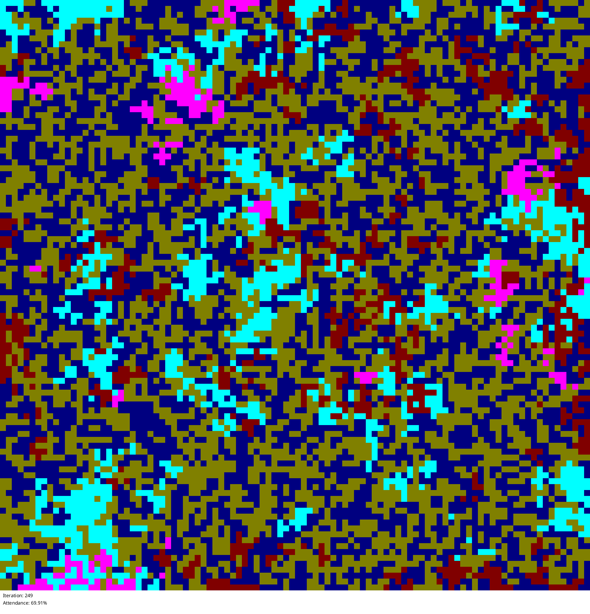
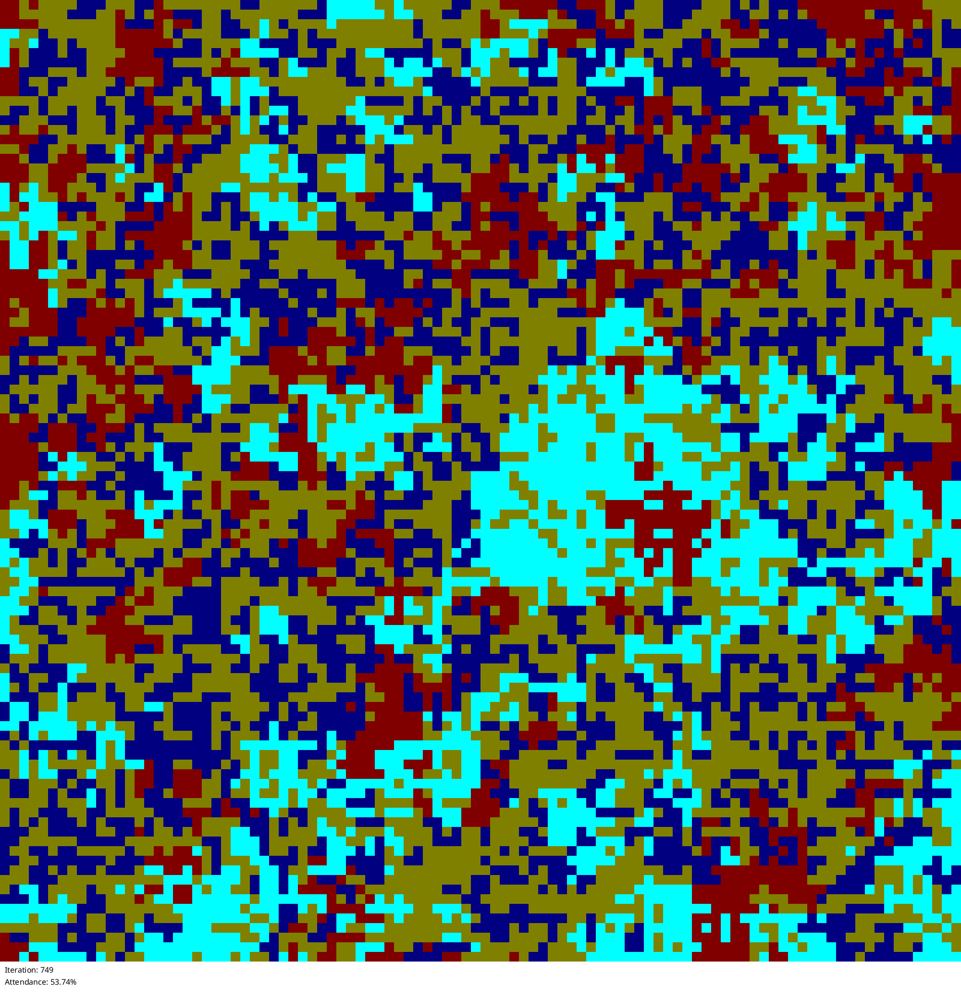

# really_high_retention_rate

Looks like the key is to have a really high retention rate

## Configuration

```
name = "really_high_retention_rate"
description = "Looks like the key is to have a really high retention rate"
grid_size = 100
neighbor_distance = 1
temperature = 0.1
policy_retention_rate = 0.8
num_iterations = 1000
rounds_per_update = 1
initial_strategies = [
    "Predict from yesterday",
    "Predict from day before yesterday",
    "Random",
    "Moving Average (3)",
    "Moving Average (10)",
    "Full History Average",
    "Even History Average",
    "Complex Formula",
    "Drunkard",
    "Stupid Nerd",
    "Generalized Mean (m=5, r=1)",
    "Generalized Mean (m=5, r=2)",
    "Generalized Mean (m=5, r=-1)",
]
start_random = true

```

## Statistics


## States







