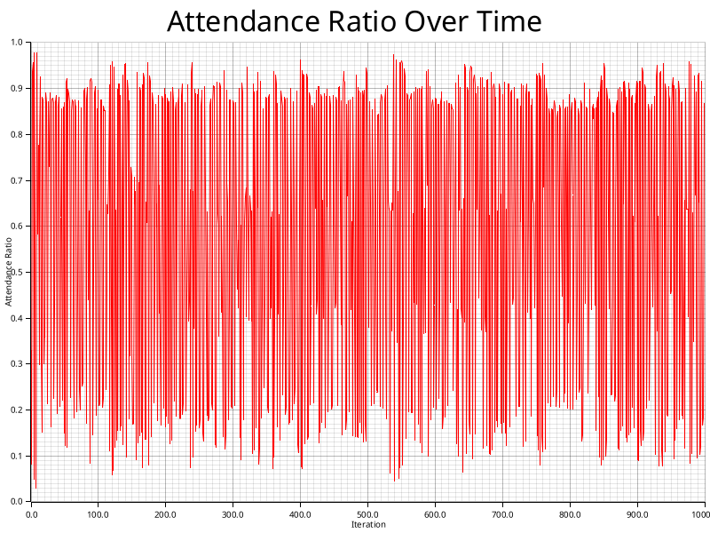
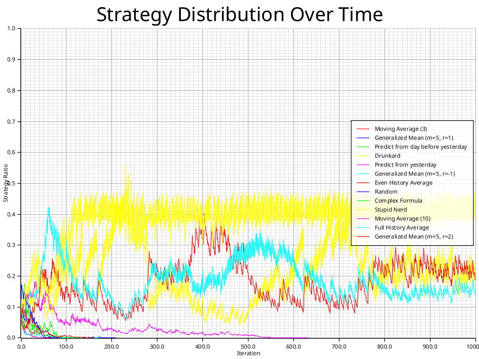
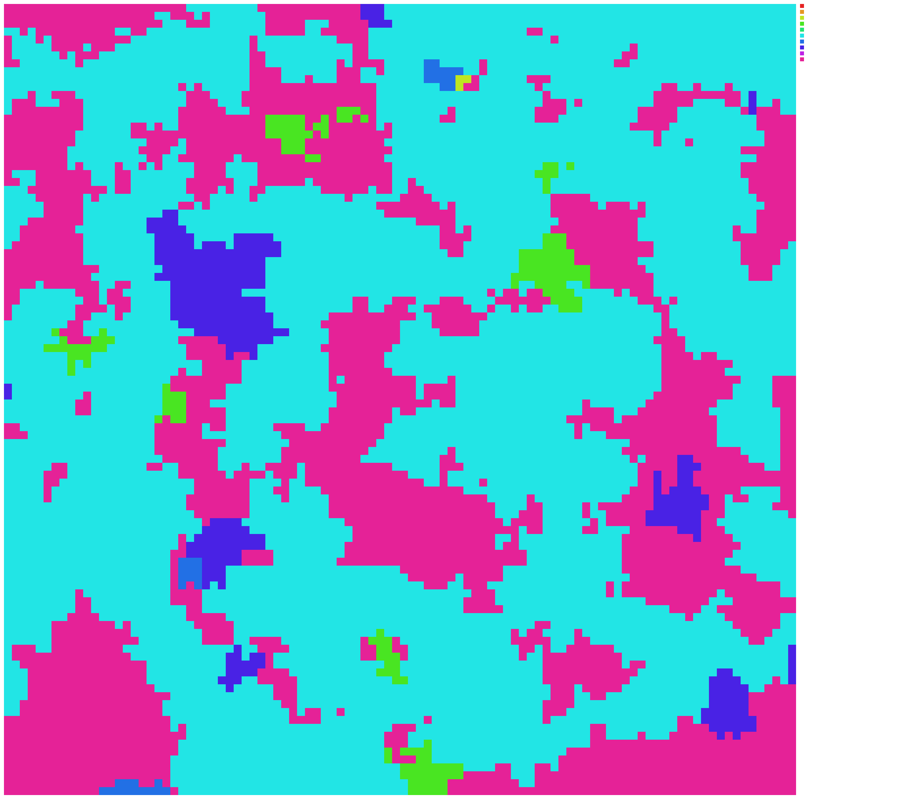
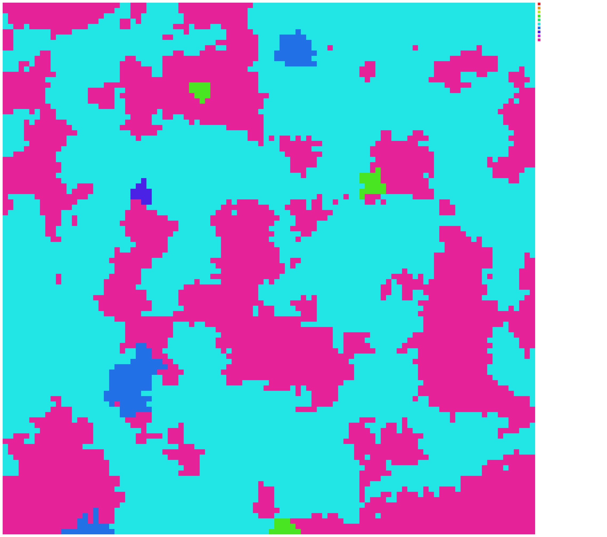
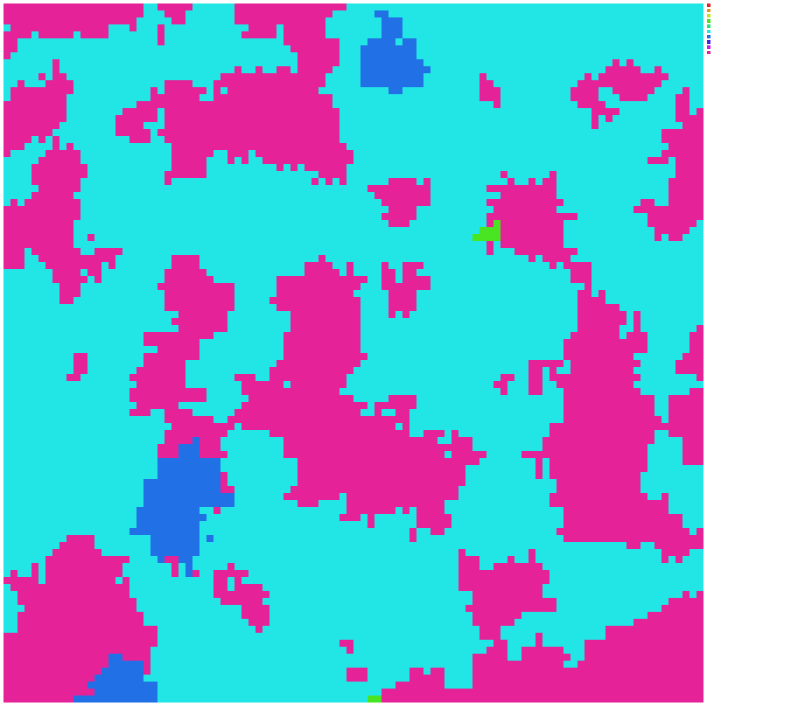
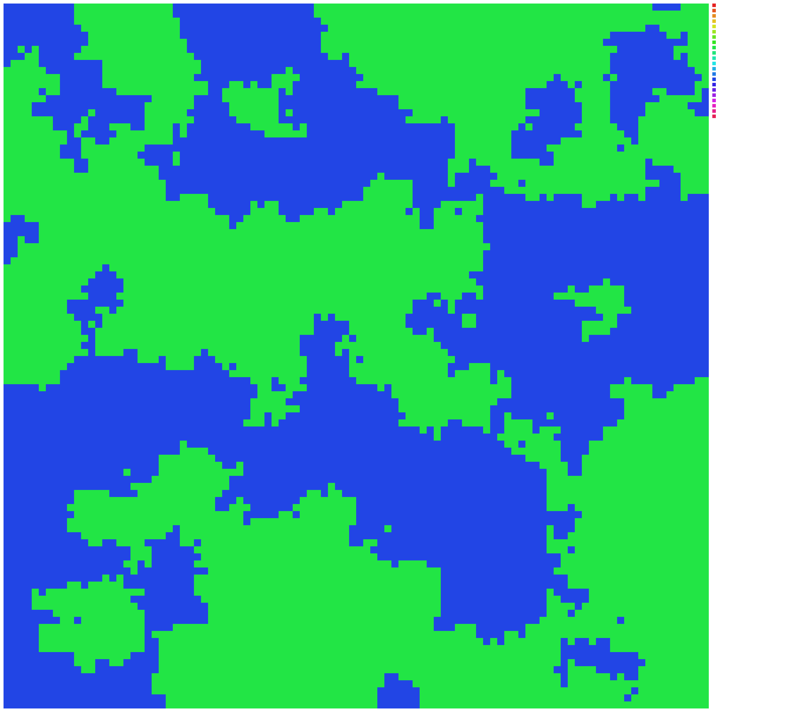

# retention_rate_0.05

A simulation with a retention rate of 0.05

## Configuration

```
name = "retention_rate_0.05"
description = "A simulation with a retention rate of 0.05"
grid_size = 100
neighbor_distance = 1
temperature = 1.0
policy_retention_rate = 0.05
num_iterations = 200
rounds_per_update = 1
initial_strategies = [
    "Always Go",
    "Never Go",
    "Predict from yesterday",
    "Predict from day before yesterday",
    "Random",
    "Full History Average",
    "Even History Average",
    "Complex Formula",
    "Drunkard",
    "Stupid Nerd",
]
start_random = true

```

## Statistics




## States







