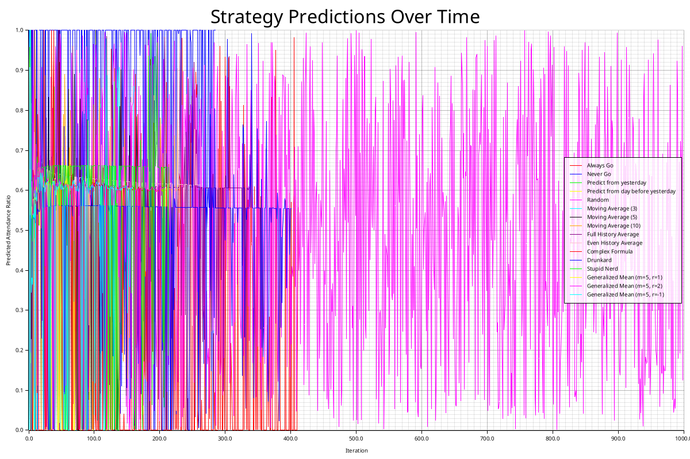
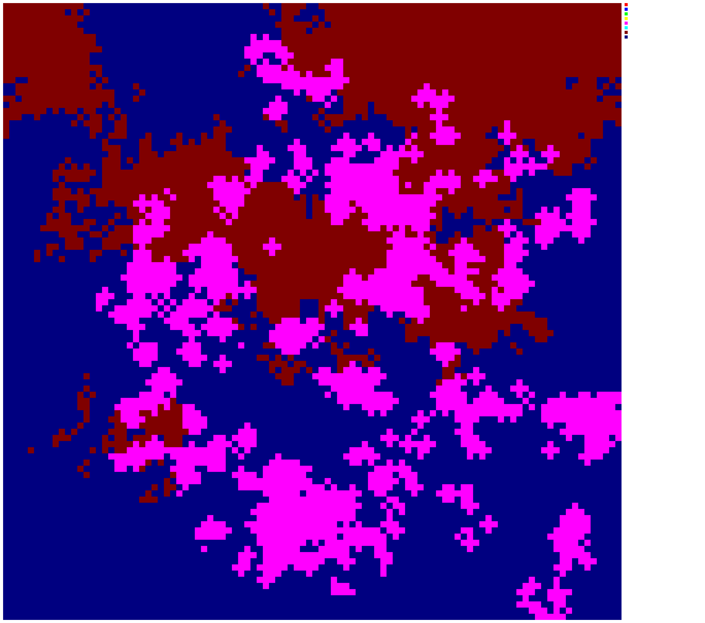
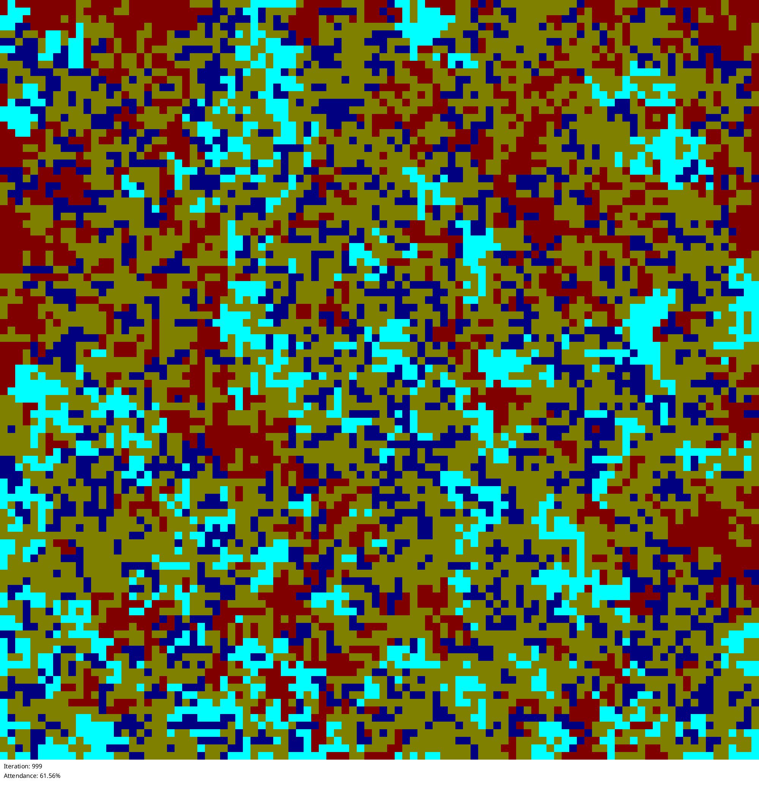
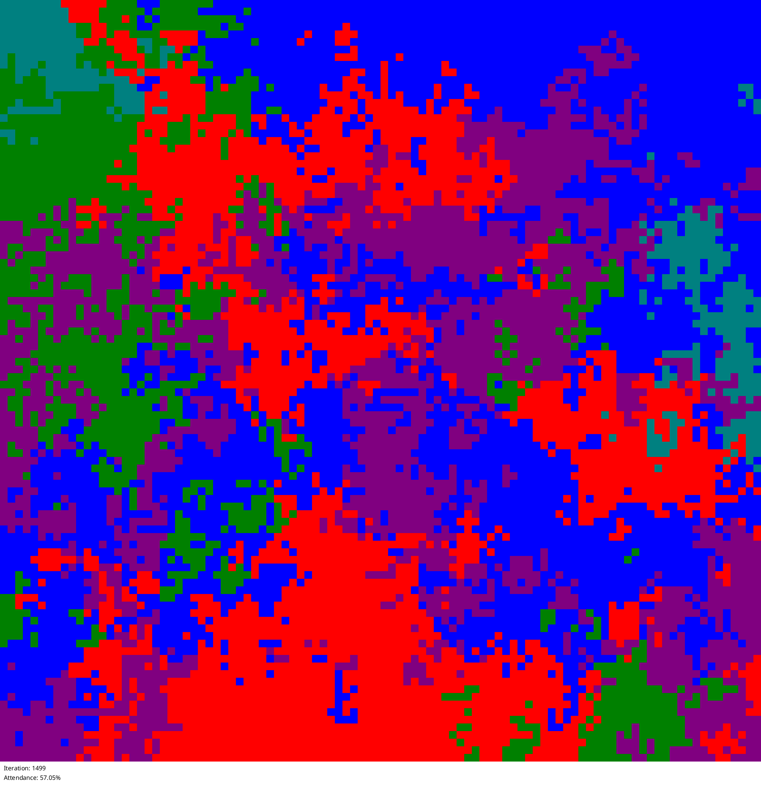
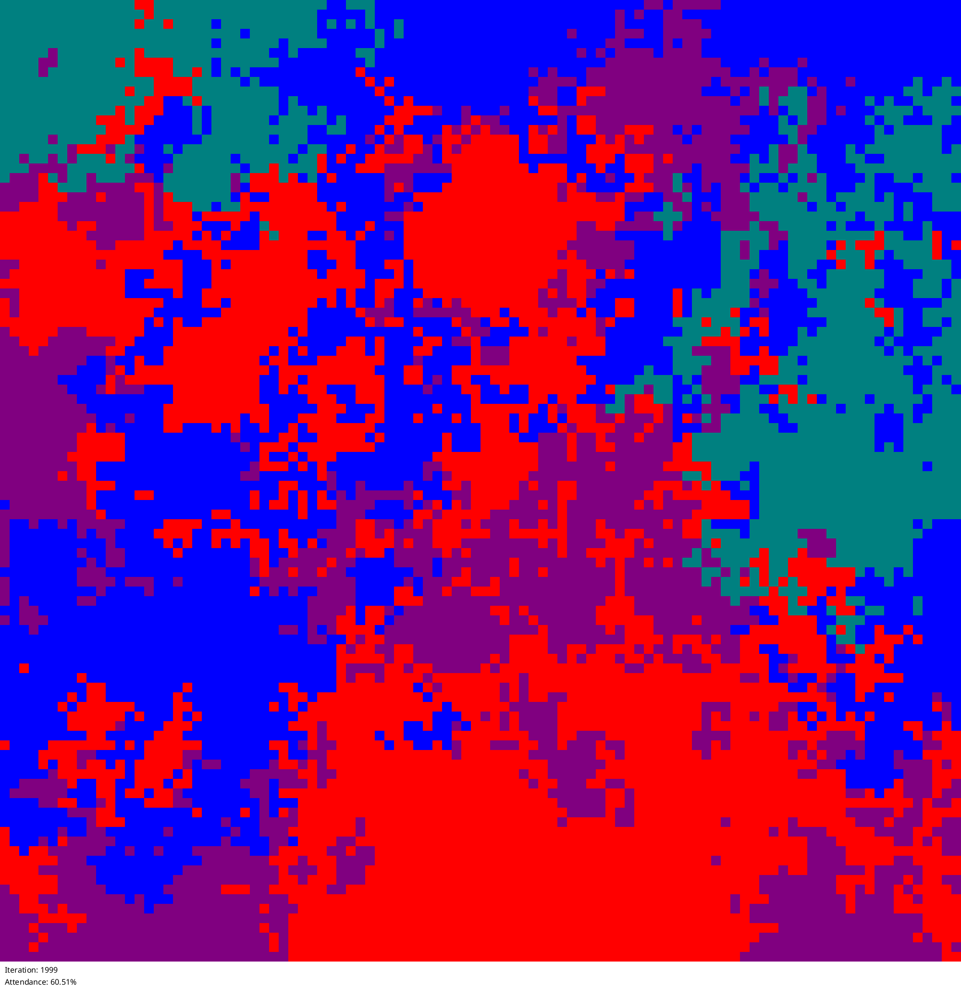

# discrete_payoff_matrix_no_random_policy

without a random policy there seems to be some equilibrium between the strategies but the surviving strategies are not always the same on each run

## Configuration

```
name = "discrete_payoff_matrix_no_random_policy"
description = "the random policy always wins"
grid_size = 100
neighbor_distance = 1
temperature = 1.0
policy_retention_rate = 0.2
num_iterations = 2000
rounds_per_update = 1
initial_strategies = [
    "Always Go",
    "Never Go",
    "Predict from yesterday",
    "Predict from day before yesterday",
    "Moving Average (3)",
    "Moving Average (5)",
    "Moving Average (10)",
    "Full History Average",
    "Even History Average",
    "Complex Formula",
    "Drunkard",
    "Stupid Nerd",
    "Generalized Mean (m=5, r=1)",
    "Generalized Mean (m=5, r=2)",
    "Generalized Mean (m=5, r=-1)",
]
start_random = true

```

## Statistics




## States







