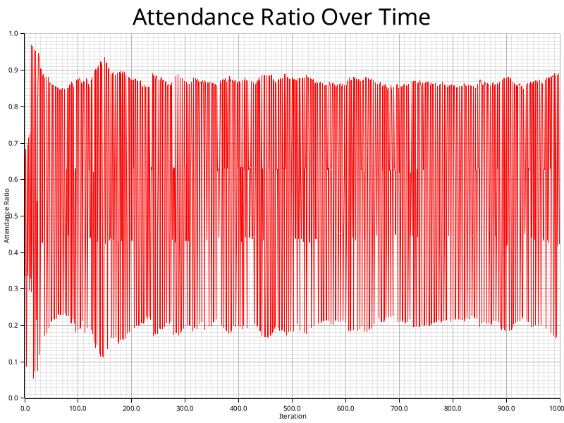
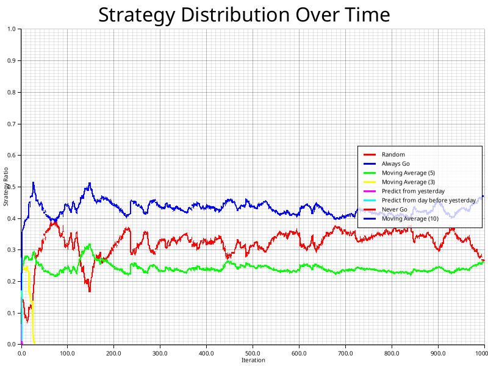
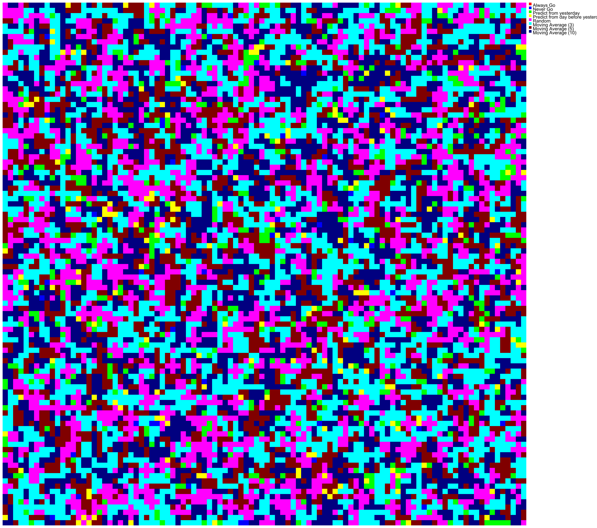
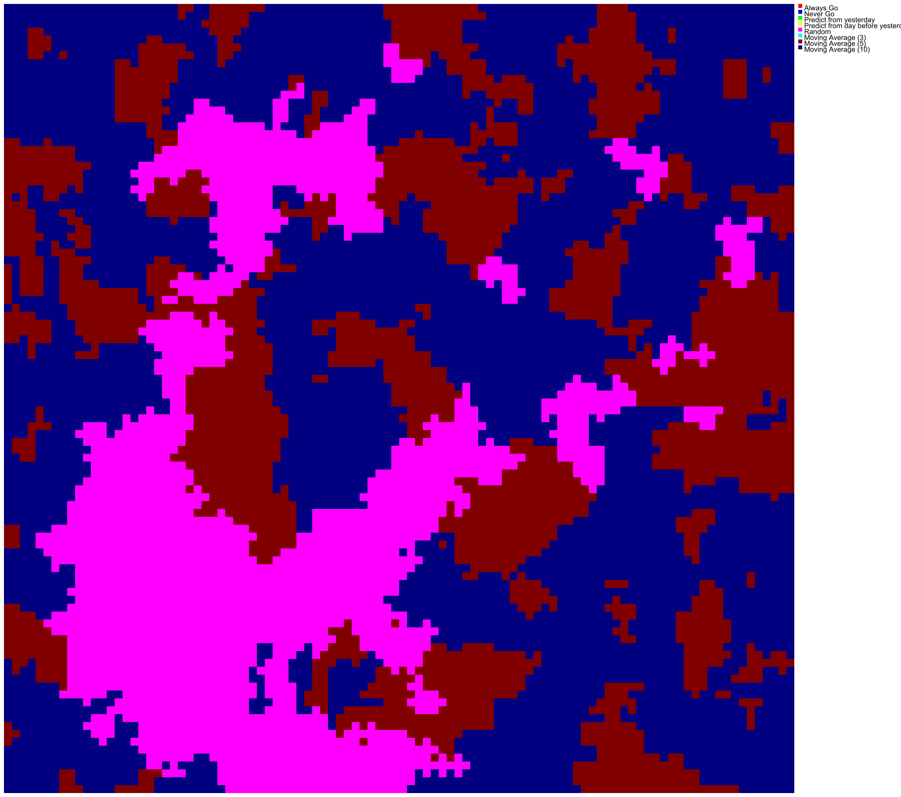
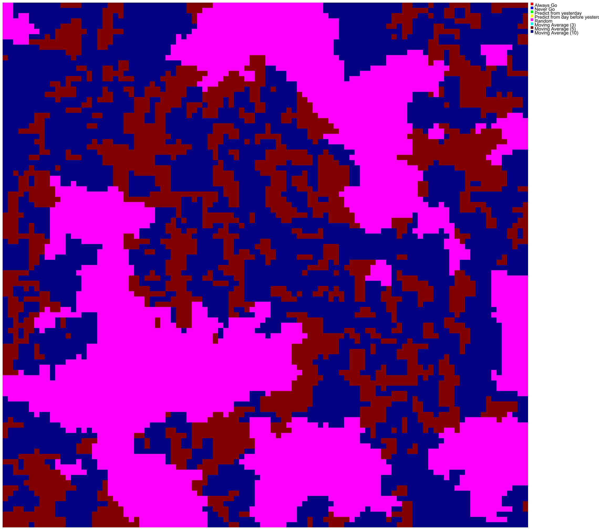
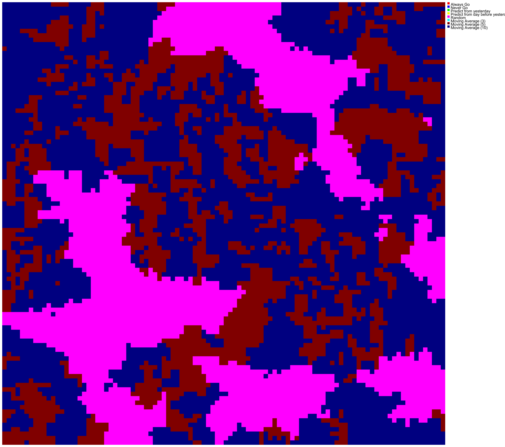

# retention_rate_0.1

A simulation with a retention rate of 0.1

## Configuration

```
name = "retention_rate_0.1"
description = "A simulation with a retention rate of 0.1"
grid_size = 100
neighbor_distance = 1
temperature = 1.0
policy_retention_rate = 0.1
num_iterations = 1000
rounds_per_update = 10
initial_strategies = [
    "Always Go",
    "Never Go",
    "Predict from yesterday",
    "Predict from day before yesterday",
    "Random",
    "Moving Average (3)",
    "Moving Average (5)",
    "Moving Average (10)",
]
start_random = true

```

## Statistics




## States







