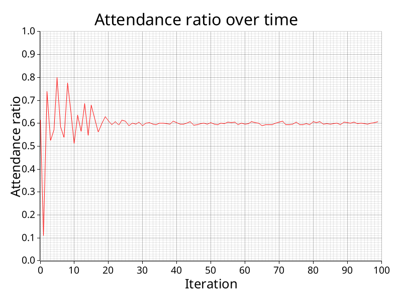

# El Farol on a Grid
We simulated the el farol bar problem on a grid of 100x100 agents. Every agent decided on going to the bar or staying home based on some strategy only knowing how many agents went to the bar in the previous rounds. Based on the performance in the last round the neighbours adapted their strategies to the ones of their neighbors using different update mechanisms.

After every round the agent get one point if they went to the bar and the bar was not crowded or if they stayed at home and the bar was crowded. Otherwise they get no points. Then they look at their neighbors in the von Neumann neighborhood and adapt to the strategy that performed the best.

## 1. Completly deterministic very simple strategies 

If we always update to the best strategy in the neighborhood we get completly deterministic behaviour given the starting position. We initiallize randomly with just the two simple strategies "always go" or "always stay home". In the first iteration half of the agents go to the bar and the bar is not crowded. Thus the "always go" strategy is better and all the agents that have at least one neihbour with this strategy adapt to it. Therefore in the next iteration there are too many agents attending the bar and it is crowded. However because the agents only look at their immediate neighborhood for adapting their strategies there are some "always stay home" agents left that just happened to be completley surrounded by others with this strategy. Here we see the advantage for only considering other strategies in a small neighbourhood. (Indeed if we consider the best strategies in a larger radius, the "always stay home" strategy completely dies out and all the agents are losing.) In our case we get pulsating behaviour, because th bar is too crowded in one round and too empty in the next because to many agents adapt to what would have been the best strategy in the previous round. The interesting thing is that such simply rules are enough that the attendance ratio get stays around 60%.

## 2. More strategies 

We add more strategies that all try to predict the attendance rate of the bar based on the previous attendance rates and then they go to the bar if they predict less than 60%. In the beginning when they don't have any history data they just predict a vlaue uniformly random. We have one strategy called "random" that always predicts uniformly random. This strategy is alwyas dominant and if we let the simulation run long enough it always wins. I think what is happening is that this strategy is the only one that is performing the same way no matter how many agents adapt to it. All the other strategies are suffering from their success. The more agents play the same strategy the worse it gets because more agents are deciding the same way. Which makes sense because the random strategy is a mixed nash equilibrium.

## 3. What if we remove the random strategy?

We get an equilibrium where multiple strategies survive. Interestingly enough it is not always the same strategies that survive. It depends on the starting configuration. As long as the strategies are uncorrelated they can survive with the same kind of pulsating behaviour as explained above but this time it is a lot more complex because of the number of strategies in play. In fact there are some tipping points where suddenly one strategy outperforms an other one by such a large margin that the ratio of the strategies instantly changes from one iteration to the next. I think these tipping points occur because many strategies rely on the average of all previous rounds in some way or another. This number changes slowly over time but as soon as it hits a certain value e.g. 60% for the simple case of the "full history average" strategy the behaviour of the agents with this strategy changes immediatly. 

## 4. Some smoothing and randomness

If we change the update mechanism to include a bit randomness we converge much better to 60% attendance rate and we still have multiple strategies surviving in their own clusters. Specifically we changed that every agent only changes his current strategy with a probability of 10% in each iteration and instead of always switching to the best strategy we use softmax.

## 5. Random still dominates

Even with these changes the random strategy still dominates and eventually is the only strategy that survives. Although perhaps unsurprisingly this takes quit a bit longer with these parameters almost always more than 4000 iterations.

## 6. Back to the simple case with only two strategies

A natural question to ask is whether this additional randomness is enough for a better convergence in the simple case of just the two most basic strategies "always go" and "always stay home". This turns out to be true and the convergence happens surprisingly quickly. After only 25 iterations we already are at 60% attendance and we never are further away than 1-2%.

